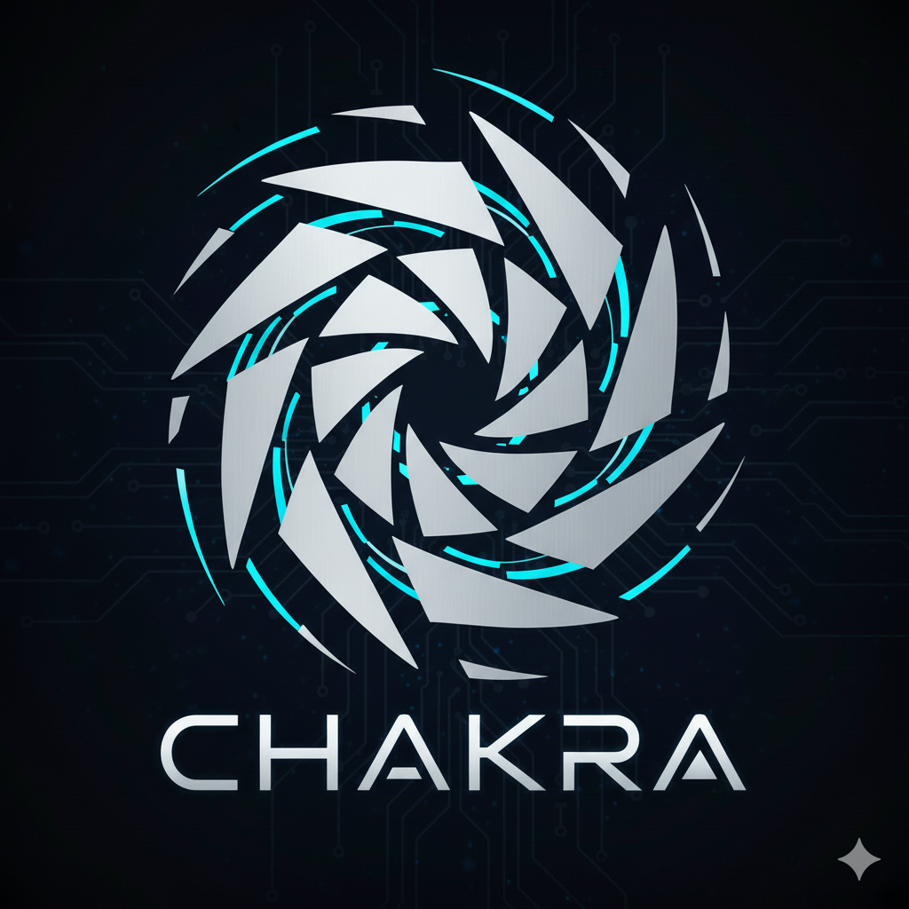

<div align="center">



# CHAKRA Middleware

**Intelligent graceful degradation for Node.js applications**

[](https://nodejs.org/)
[](https://www.typescriptlang.org/)
[](https://expressjs.com/)
[](LICENSE)
[](#commands)
[](CONTRIBUTING.md)

---

CHAKRA sits in front of your Express app and manages traffic surges by routing requests to reduced-functionality versions of your application based on real-time system stress and request priority.

When your infrastructure is scaling up but not yet ready, CHAKRA bridges the gap — keeping critical requests (payments, checkouts) fully functional while gracefully degrading less important endpoints.

[Quick Start](#quick-start) | [Core Concepts](#core-concepts) | [Dashboard](#dashboard) | [Architecture](#architecture) | [License](#license)

</div>

## How It Works

CHAKRA uses a physics-inspired model: imagine a spinning disc with concentric rings. As load increases (the disc spins faster), requests are "thrown" outward to outer rings with reduced functionality. High-priority requests have more "mass" and resist being thrown outward, staying close to the core where full functionality is preserved.

Each incoming request gets one of three outcomes:

- **SERVE_FULLY** — request passes through to your backend unchanged
- **SERVE_LIMITED** — request passes through with `X-Chakra-*` headers signaling reduced functionality
- **SUSPEND** — CHAKRA returns a fallback response directly; your backend never sees the request

## Quick Start

```bash
npm install chakra-middleware
```

**1. Create a config file** (`chakra.config.yaml`):

```yaml
mode: manual
version: "1"
activate_when:
  rpm_threshold: 70
dashboard:
  enabled: true
  port: 4242
```

**2. Add to your Express app** (two lines):

```javascript
const { chakra } = require('chakra-middleware');

const app = express();
const ch = chakra('./chakra.config.yaml');

// Mount middleware
app.use(ch.middleware());

// Annotate routes with blocks
app.post('/api/payment', ch.block('payment-block'), paymentHandler);
app.get('/api/products', ch.block('api-block'), productsHandler);
app.get('/static/style.css', ch.block('static-block'), staticHandler);

app.listen(3000);
```

That's it. CHAKRA starts learning your traffic patterns immediately via Shadow Mode.

## Core Concepts

### Blocks

Group your routes into logical blocks (e.g., `payment-block`, `api-block`, `static-block`). Each block can be independently degraded or suspended based on load. Critical blocks like payments resist degradation through the Weight Engine.

### Ring Map

Maps each `METHOD:PATH` to a block with a minimum degradation level and base weight. Shadow Mode auto-generates a suggested Ring Map by observing your traffic.

### RPM Score

A composite 0-100 load score combining three signals:
- Request Arrival Rate (30%)
- Response Latency P95 (40%)
- Error Rate Delta (30%)

Updated every 5 seconds with smoothing across 3 readings.

### Activation Modes

- **Manual** — activate/deactivate via the dashboard
- **Auto** — CHAKRA watches RPM and activates when thresholds are breached for a sustained period

### Weight Engine

When a request hits a suspended block, the Weight Engine calculates a 0-100 priority score using 8 signals: block base weight, HTTP method, authentication status, session depth, cart items, moment-of-value signatures, user tier, and developer overrides. High-weight requests break through suspension.

### Shadow Mode

Runs from the moment CHAKRA is installed. Silently observes all requests (never touches the request path) and learns in 4 layers:

1. **App Structure** (hours) — endpoints, methods, response patterns
2. **Traffic Patterns** (days) — peak times, request distributions
3. **User Behaviour** (weeks) — session flows, conversion paths
4. **Failure Signatures** (requires a stress event) — what breaks first

Produces suggestions for Ring Map configuration, RPM thresholds, and policies. Never auto-activates — always requires human approval.

### Policy Engine

Developer-written rules evaluated during dispatch:

```yaml
policies:
  - name: protect-checkout
    priority: 100
    conditions:
      block: checkout-block
      session_depth_gte: 3
      has_cart_items: true
    action: serve_fully
```

Supports conditions like `user_tier`, `session_depth`, `cart_items`, `rpm_above`, `time_between`, and more.

## Dashboard

CHAKRA serves a web dashboard on port 4242 (configurable) with:

- Live RPM chart with threshold indicators
- Block state grid showing active/suspended status per block
- Shadow Mode learning progress across all 4 layers
- Policy management with emergency presets
- Manual activation/deactivation controls
- Real-time updates via WebSocket during active incidents

## Architecture

```
Request Flow (hot path, <2ms budget):

  HTTP Request
       |
  [ Dispatcher ] ── read ── Ring Map (O(1) lookup)
       |                     Block States
       |                     RPM Snapshot
       |
   suspended? ── no ──> SERVE_FULLY
       |
      yes
       |
  [ Weight Engine ] ── score >= 65 ──> SERVE_FULLY
       |                score 40-64 ──> SERVE_LIMITED
       |                score < 40  ──> SUSPEND
       |
  [ Policy Engine ] ── rule override? ──> apply action
       |
    outcome

Background processes (async, never on request path):

  [ RPM Engine ]      — updates load score every 5s
  [ Shadow Mode ]     — observes requests, runs analysis hourly/daily
  [ Session Cache ]   — in-memory session context store
  [ Container Bridge] — reads K8s/ECS/Prometheus signals (optional)
```

## Container Bridge (Optional)

Reads infrastructure signals to make Auto Mode more precise:

- **Kubernetes** — HPA status, pod readiness
- **ECS** — AWS service scaling state
- **Prometheus** — generic metric queries
- **Webhook** — POST endpoint for custom infrastructure

CHAKRA never manages infrastructure — it only reads signals to answer: is scaling in progress? how long until ready? at capacity limit?

## Commands

```bash
npm run build          # TypeScript compile
npm test               # Run all tests (583 tests across 12 suites)
npm run test:watch     # Vitest watch mode
npm run lint           # ESLint
npm run dev            # Start in watch mode
```

## Project Structure

```
src/
  index.ts                     # Entry point, public API
  types.ts                     # Shared interfaces
  core/
    dispatcher.ts              # Hot path (<2ms)
    weight-engine.ts           # Request priority scoring
    ring-mapper.ts             # Route-to-block lookup
    policy-engine.ts           # Rule evaluator
    activation.ts              # Manual/Auto mode control
  background/
    rpm-engine.ts              # Load signal producer
    session-cache.ts           # In-memory session store
    shadow-mode/
      observer.ts              # Request observation
      analyser.ts              # Pattern analysis
      suggester.ts             # Ring Map & policy suggestions
  integrations/
    express.ts                 # Express adapter
    container-bridge/          # K8s, ECS, Prometheus, Webhook
  dashboard/
    server.ts                  # Dashboard HTTP server
    api.ts                     # REST + WebSocket API
    dashboard.html             # Single-page dashboard UI
  config/
    loader.ts                  # YAML config reader
    defaults.ts                # Default values
  utils/
    hasher.ts                  # SHA-256 hashing (privacy)
    logger.ts                  # Structured logging
```

## Design Principles

- **Never crash the host app.** If any CHAKRA component fails, it disables itself silently. Uncaught exceptions never escape the middleware.
- **Privacy first.** All user IDs and session tokens are SHA-256 hashed before storage. No request/response bodies are ever stored.
- **Read-only hot path.** The Dispatcher never writes state. All writes happen in background processes via atomic snapshot swaps.
- **Suggest, don't auto-activate.** Shadow Mode learns and suggests; humans decide when to activate.

## License

Apache-2.0
